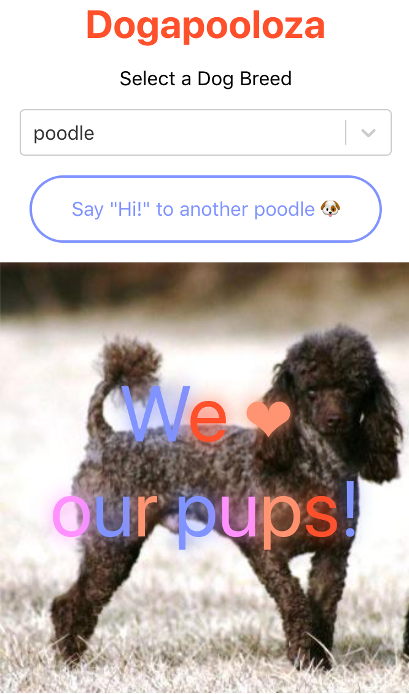

# Dogapooloza App

                                                      
## Current Functionality
- Displays a random photo of a dog on initial load
- Allows users to select a specific dog breed they’d like to see from a dropdown menu 
- Allows users to click a button in order to get a new photo.
- Overlays photo with text

## Future Functionality to Implement 
- [ ] Increase test coverage
	- [ ] i.e., mock fetch
- [ ] Improve styling and make it more mobile-responsive
- [ ] Modularize code more into more composable files 
- [ ] Implement more robust and resilient way of extracting breed of a photo from the url in order to approve aria-label text
- [ ] Add server-side rendering 

## Instructions for Developing 
1. Install dependencies in the root with `yarn` .
2. Run development version of app locally at http://localhost:3000 with `yarn start`
3. Run `yarn test` to run unit tests 

## Instructions for Deploying 
- Run `yarn build` in order to create a production version of the application in the `/build` directory.
